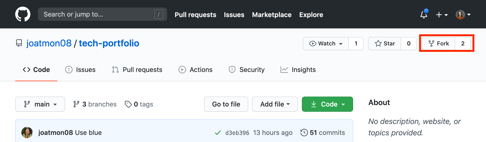
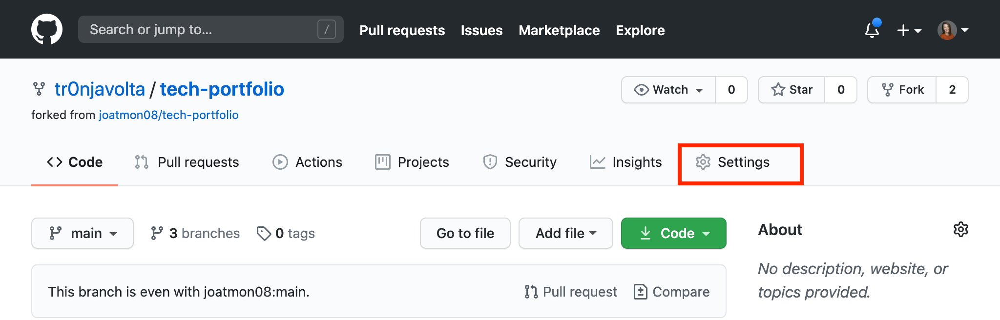
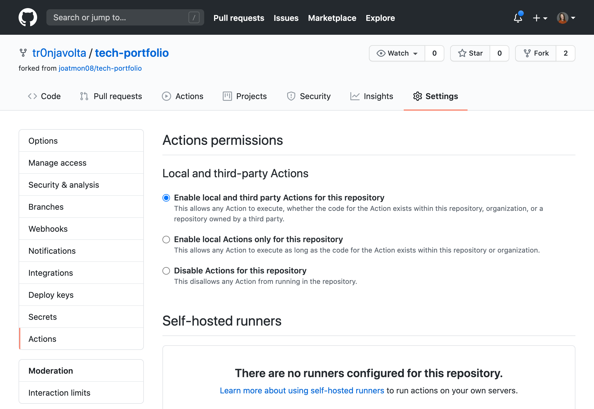
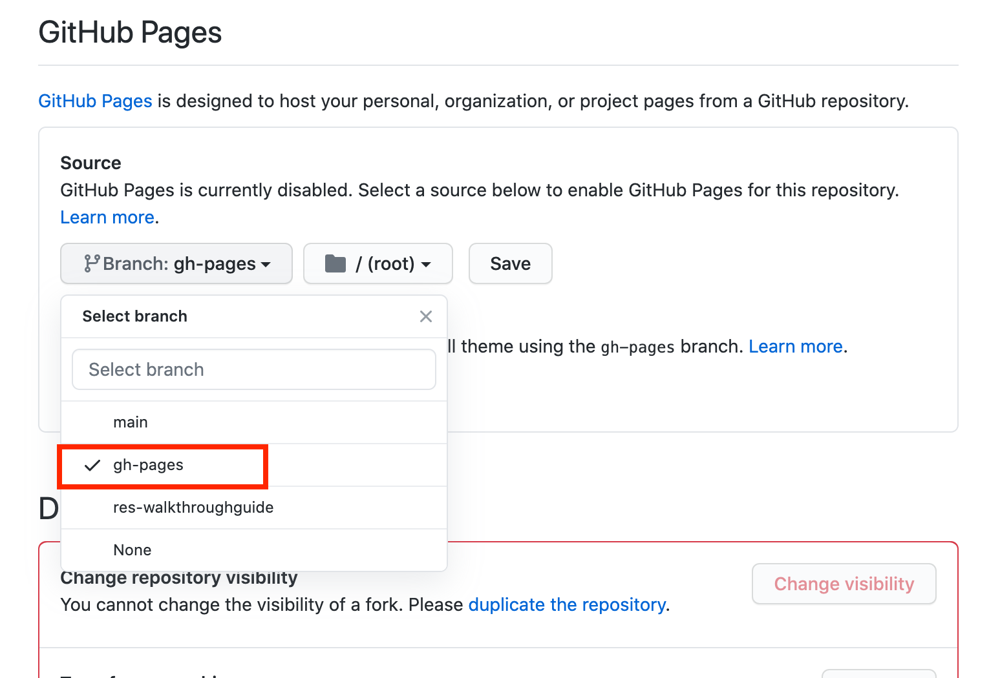
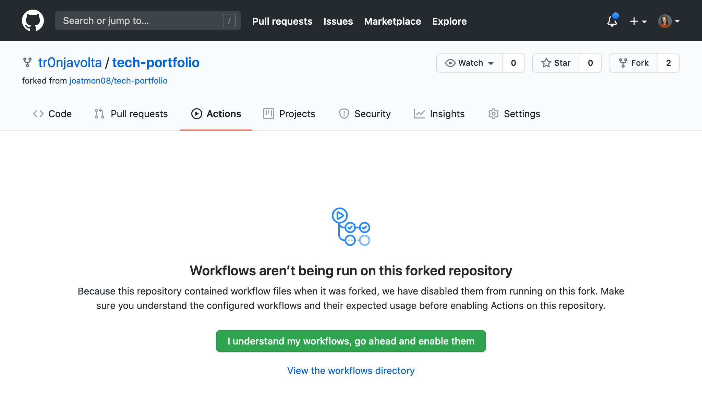
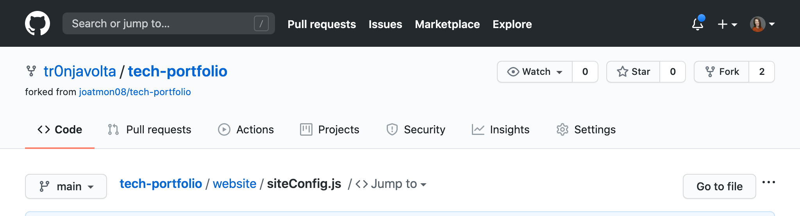
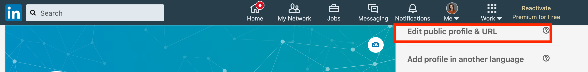
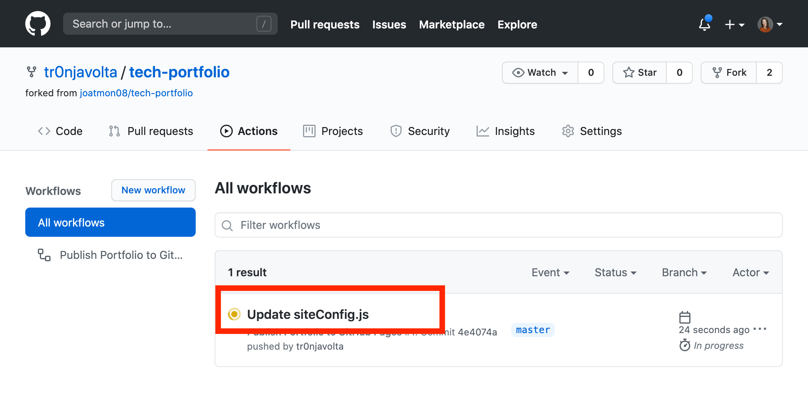
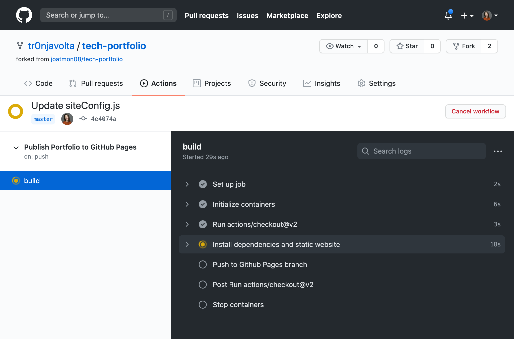

# Build your own Technical Portfolio

This repository allows you to create your own technical portfolio page! You are welcome to extend it for other uses, such as blogs or documentation.

## Tutorial prerequisites
* [A GitHub Account](https://github.com/signup) 

## Fork and configure the portfolio template repository

Navigate to the [tech-portfolio](https://github.com/joatmon08/tech-portfolio) in your web browser.

Fork this repo to your GitHub user.



This repo contains all of the necessary files to deploy your technical portfolio; however, you need to configure this repository with the necessary settings to make it a GitHub Pages site.

Navigate to Settings in your forked repo.



In the Settings page, navigte to "Actions" and ensure “Enable local and third party Actions for this repository” is enabled.



On the Settings page, navigate to "Options" and scroll to the bottom to the "GitHub Pages" section.

Change the Source branch to "gh-pages" and keep the "/(root)" path and save this change.



Go to the Actions page of the repostiory.



This original repo has a workflow file already configured and GitHub disables these when you fork them by default. To enable this pre-configured workflow, select the "I understand my workflows, go ahead and enable them."

-> **Note** The Actions workflow will not do anything until you make additional changes.

Now you are ready to move into the repo and make this portfolio your own!

## Edit your portfolio with your personal info

Navigate to the Code page of your repo. Click on the "website" folder and open the `siteConfig.js` file.



Click on the pencil icon to edit this file.


There are four text fields and three social media links for you to update.

### Update with your name and tagline

Find the `title:` field and add your name. Remember to keep this field in single quotes.

```js
...
title: 'YOUR NAME',
```

The next line is `tagline:`. This field appears on your portfolio front page. Replace the placeholder with a description of you in three adjectives and the type of work you do or are looking for. Keep this field in single quotes as well.

### Update your site URL and organization

The next line is `url` and should be your GitHub username.

```js
...
url: 'https://YOUR-GITHUB-USER.github.io',
```

Keep the `baseUrl` and `projectName` fields the same.

!> We are using a project GitHub page, not a global one associated with your username. If you do want your portfolio to be located at `your-user.github.io`, you must change the name of the repository.

Your `organizationName` is your GitHub username.

```js
...
organizationName: 'YOUR-GITHUB-USER',
```

### Update your social media links

Scroll to the bottom of the `siteConfig.js` file in the editor.

Update with your Twitter & GitHub usernames.

To find your LinkedIn public profile name, login to your LinkedIn account and view your profile.

On your profile page, click "Edit public profile & URL" from the upper right section of the page.



Under "Edit your custom URL" copy the text after the `https://www.linkedin.com/in/` portion of the URL. This is your LinkedIn username. 

Paste it in your `linkedin:` setting.

```js
linkedin: 'YOUR-LINKEDIN-USER',
```

Once you have updated all of the above fields, you are ready to commit these initial changes.

Click the "Commit changes" button to save your changes.

## Review the Actions workflow

To observe GitHub Actions building your page, go the "Actions" section of the repo.



Click on the "Update siteConfig.js" job. GitHub displays the actions it is taking to build & publish your portfolio.



When the "build" job is complete, navigate to your portfolio in another tab of your web browser. 

Your URL is "https://YOUR-GITHUB-USERNAME.github.io/tech-portfolio/" and this site displays your live portfolio.

Congratulations! You completed this walkthrough and have a live technical portfolio! Any changes in your forked repo will trigger a new build and will update your site.
