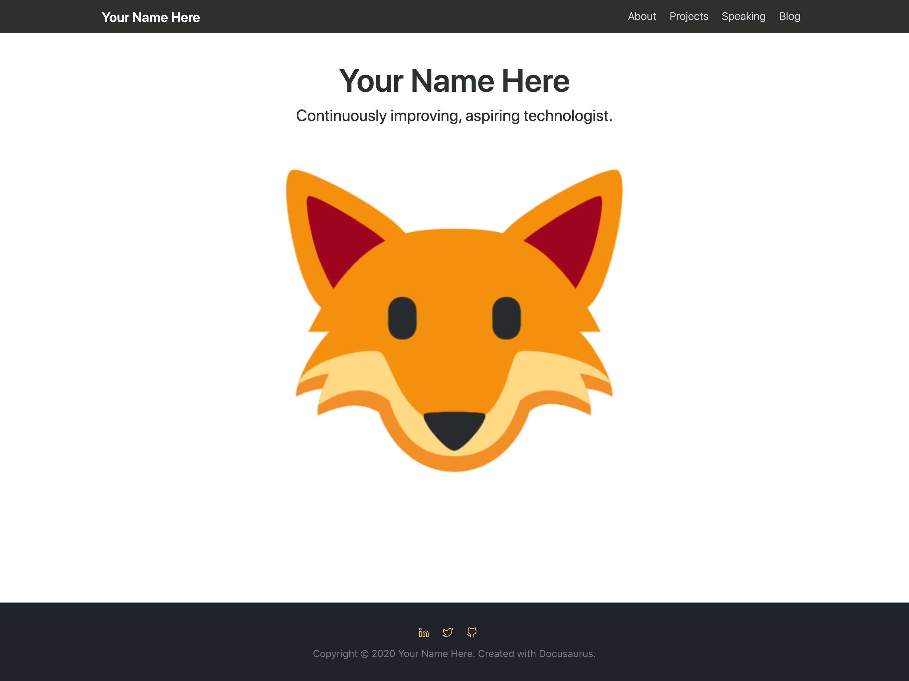

# Build your own Technical Portfolio

This repository allows you to create your own technical portfolio page! You are welcome to extend it for other uses, such as blogs or documentation.

## Tutorial prerequisites
* [Install git](https://git-scm.com/book/en/v2/Getting-Started-Installing-Git)
* [Install Node.js](https://nodejs.org/en/)
    * If you have `brew` installed, use the commandline to install with: `brew install node`
* **Optional** [Install VSCode](https://code.visualstudio.com/Download)

## Download the prebuilt repo and dependencies

Clone this repository to your local machine if you haven't already.

```shell
$ git clone https://github.com/joatmon08/tech-portfolio.git
```

This repo contains all of the necessary files to deploy your technical portfolio, but you must install a few dependencies locally to edit & test.

Change into the `website` directory of the repo on your local machine.

```shell
$ cd website
```

This folder contains the code and markdown for your portfolio. Test it locally by installing & starting `npm` to see the initial template you will be editing.


```shell
$ npm install
```

This command installs the necessary `npm` files locally and allows your machine to act as `localhost` for your website.

To see the initial template, run the `start` command.

```
$ npm start
```

You may receive a security warning that asks to allow npm to control your web browser. Allow this action.


Your web browser will launch automatically and display the template. Navigate through this site to see what pages you have access to.



## Build your portfolio

Open the repository demo folder in VSCode. This will help navigate through the site.

### Edit the Site Config file

Open the file `website/siteConfig.js` and edit with your name and information.

```text
...
 title: 'Your Name Here', // Title for your website.
    tagline: 'Continuously improving, aspiring technologist.',
    profilePhoto: 'img/profile.png',
    url: 'https://joatmon08.github.io', // Your website URL
    baseUrl: '/tech-portfolio/', // Base URL for your project */
    // For github.io type URLs, you would set the url and baseUrl like:
    //   url: 'https://facebook.github.io',
    //   baseUrl: '/test-site/',

    // Used for publishing and more
    projectName: 'tech-portfolio',
    organizationName: 'joatmon08',
    // For top-level user or org sites, the organization is still the same.
    // e.g., for the https://JoelMarcey.github.io site, it would be set like...
    //   organizationName: 'JoelMarcey'
...
```

Once you add your information, save your changes.

### Edit your About page

Navigate to the `docs` folder and edit the `about.md` page with your resume or educational background.

```txt
You can start your "About" page with an elevator pitch, one or two
sentences about you! The rest of this page page can
include a little bit about yourself. Some things you
might include:

1. Your current position
1. Organizations you're involved with
1. Your personal and professional values
1. Hobbies or fun facts

Write it in first (I) or third (Your Name Here) person. Optional sections
listed below.

## Current Role

Grace Hopper Celebration Attendee

## Recognition

- 2020 Awesome Woman in Technology Award

## Social Media

- Twitter
- LinkedIn
- GitHub
```

Save your changes.

-> **Note:** Editing the Projects & Speaking pages in this tutorial is optional.

### Edit your Projects page

Navigate to the `docs` folder and edit the `projects.md` page with any notable projects you would like to highlight.

```txt
```

Save your changes.

### Edit your Speaking page

Navigate to the `docs` folder and edit the `speaking.md` page with any public speaking engagements you would like to highlight.

```txt
```

Save your changes.

### Edit your social media links

Navigate to the `core` directory and open `footer.js` to edit the social media links for your site.

In this file, search(Command+F for Mac users or Ctrl+F for Windows users) for "linkedin.com" which should highlight one result.

Add your LinkedIn profile address after the `/`. The address should look like `https://www.linkedin.com/YOUR-USER-NAME/`.

Repeat these steps for GitHub & Twitter.

Save this file.

## View your personalized portfolio

In your web browser, refresh the template page and you should see your edited information!


## Push your portfolio to GitHub pages

TODO
