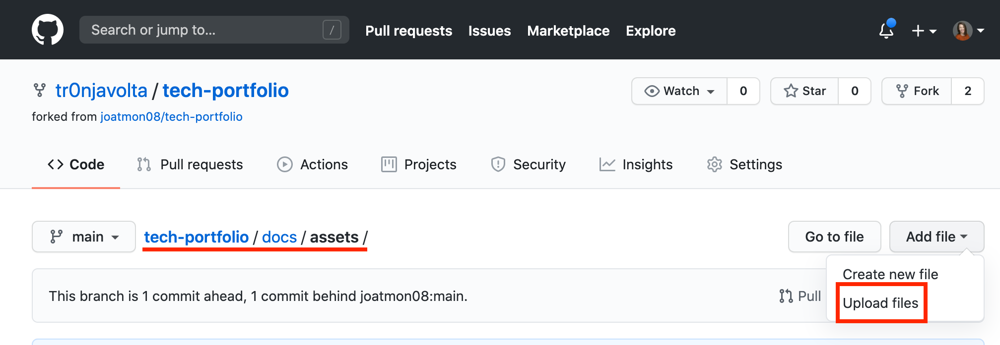
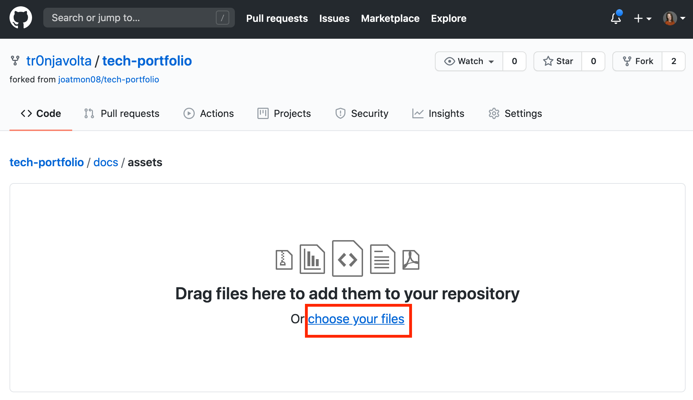
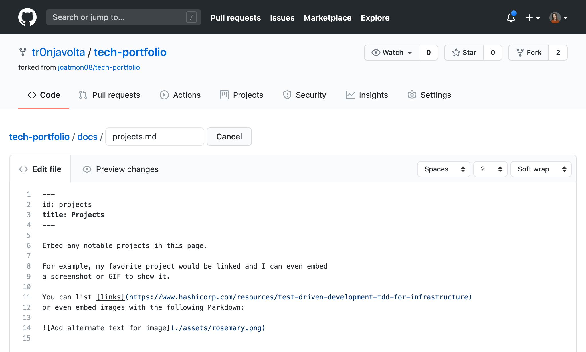
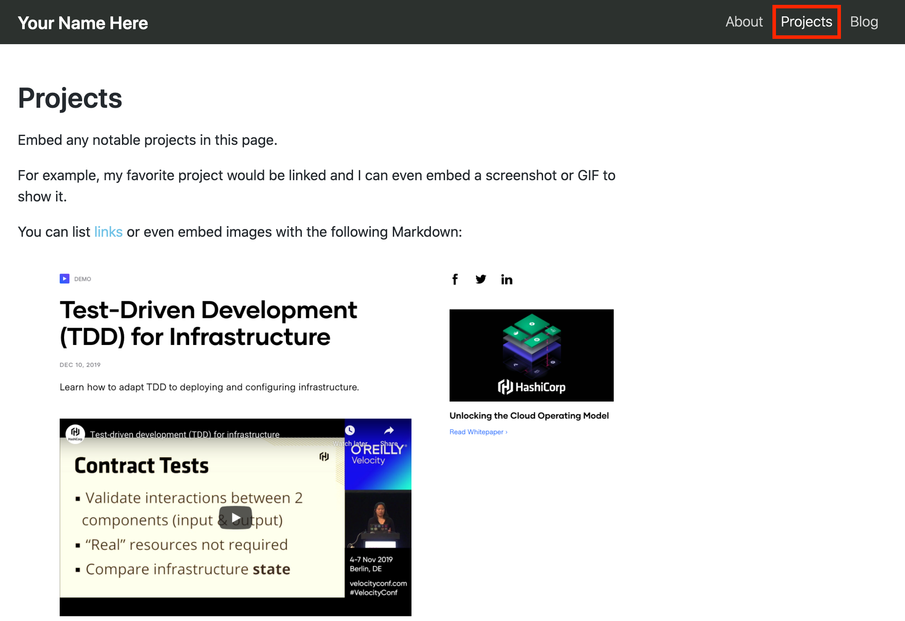

# Build your own Technical Portfolio

This repository allows you to create your own technical portfolio page!
You are welcome to extend it for other uses, such as blogs or documentation.

> This repository was originally created for Grace Hopper Celebration 2020 and is constantly being updated based
> on the feedback of the workshop participants. If you previously used this repository and want to apply your updates,
> copy your changes and save them somewhere.

**If you have problems with this repository, please see our [frequently asked questions](./FAQ.md) page.**

* [Prerequisites](#prerequisites)
* [Getting Started](#getting-started)
    * [Edit your portfolio with your personal info](#edit-your-portfolio-with-your-personal-info)
      * [Update with your name and tagline](#update-with-your-name-and-tagline)
      * [Update your site URL and organization](#update-your-site-url-and-organization)
    * [Commit your changes](#commit-your-changes)
    * [Review the Actions workflow](#review-the-actions-workflow)
* [Updating Social Media Links](#updating-social-media-links)
* [Update your Projects Page](#update-your-projects-page)

## Prerequisites
* [A GitHub Account](https://github.com/signup)
* [Markdown Cheatsheet](https://guides.github.com/features/mastering-markdown/): This is used for typing your blog, about, and project pages.
* For more information about Markdown, visit [this guide from GitHub](https://guides.github.com/pdfs/markdown-cheatsheet-online.pdf).

## Getting Started

You'll need to copy this repository to your Github username and enable a few settings.

1. Navigate to the [tech-portfolio](https://github.com/joatmon08/tech-portfolio) in your web browser.

1. Fork this repo to your GitHub user.
   
   This repo contains all of the necessary files to deploy your technical portfolio; however, you need to configure this repository with the necessary settings to make it a GitHub Pages site.
   
   > :bangbang: Ensure you are on your forked repository by checking the upper left title of the repo. It should contain your GitHub user name.

1. Navigate to Settings in your forked repo.
   

1. On the Settings page, navigate to "Options" and scroll to the bottom to the "GitHub Pages" section.

1. Change the Source branch to "gh-pages" and keep the "/(root)" path and save this change. This contains the GitHub Actions workflow.
   

1. Go to the Actions page of the repostiory.
   

1. This original repo has a workflow file already configured and GitHub disables these when you fork them by default. To enable this pre-configured workflow, select the "I understand my workflows, go ahead and enable them."

   > :bangbang: The Actions workflow will not do anything until you make additional changes.

Now you are ready to move into the repo and make this portfolio your own!

### Edit your portfolio with your personal info

1. Navigate to the Code page of your repo and make sure you are on the `main` branch. Click on the "website" folder and open the `siteConfig.js` file.
   

1. Click on the pencil icon to edit this file.
   

There are four text fields and three social media links for you to update.

#### Update with your name and tagline

1. Find the `title:` field and add your name. Remember to keep this field in single quotes.
   ```js
   ...
   title: 'YOUR NAME',
   ```

1. The next line is `tagline:`. This field appears on your portfolio front page. Replace the placeholder with a description of you in three adjectives and the type of work you do or are looking for. Keep this field in single quotes as well. While we didn't put a character limit, keep it to 140 characters or less!
  ```js
   ...
   tagline: 'Technologist, awesome, and amazing.',
  ```

#### Update your site URL and organization

1. The next line is `url` and should be your GitHub username.
    ```js
    ...
    url: 'https://YOUR-GITHUB-USER.github.io',
    ```

1. Keep the `baseUrl` and `projectName` fields the same.
   > :bangbang: We are using a project GitHub page, not a global one associated with your username. If you do want your portfolio to be located at `your-user.github.io`, you must change the name of the repository.

1. Your `organizationName` is your GitHub username.
   ```js
   ...
   organizationName: 'YOUR-GITHUB-USER',
   ```

### Commit your changes

1. Once you have updated all of the above fields, you are ready to commit these initial changes.
1. Click the "Commit changes" button to save your changes.

### Review the Actions workflow

To observe GitHub Actions building your page, go the "Actions" section of the repo.


Click on the "Update siteConfig.js" job. GitHub displays the actions it is taking to build & publish your portfolio.


When the "build" job is complete, navigate to your portfolio in another tab of your web browser.

Your URL is "https://YOUR-GITHUB-USERNAME.github.io/tech-portfolio/" and this site displays your live portfolio.

Congratulations! You completed this walkthrough and have a live technical portfolio! Any changes in your forked repo will trigger a new build and will update your site.


## Updating Social Media Links

1. Scroll to the bottom of the `website/siteConfig.js` file in the editor.

1. Check out the `socialMedia` section. This section controls the social media icons and links at the bottom of your portfolio!
   ```js
    socialMedia: {
        linkedin: 'https://www.linkedin.com/in/',
        twitter: 'https://twitter.com/',
        github: 'https://github.com/',
        //facebook: 'https://www.facebook.com/',
        //instagram: 'https://www.instagram.com/',
        //youtube: 'https://www.youtube.com/',
        //twitch: 'https://www.twitch.tv/'
    },
   ```
   

1. Navigate to your social media profile page. Copy the URL and paste it into the field.
   1. For example, find your LinkedIn public profile name, login to your LinkedIn account and view your profile.
   1. On your profile page, click "Edit public profile & URL" from the upper right section of the page.
      
   1. Under "Edit your custom URL", copy the entire URL (`https://www.linkedin.com/in/yourprofile`). This is your LinkedIn profile URL.
   1. Paste it in your `linkedin:` setting.
      ```js
      linkedin: 'https://www.linkedin.com/in/yourprofile',
      ```

1. If you want to add social media, check out the commented lines (lines starting with `//`). You can enable the social
   media icons by delete the `//` from the line.
    ```js
    linkedin: 'https://www.linkedin.com/in/yourprofile', <- delete the // at the beginning of the line to use
    ```

1. If you don't have a social media profile for the specific website, you can add the `//` to the beginning of the line. These will be ignored.
    ```js
    // linkedin: 'https://www.linkedin.com/in/yourprofile', <- added the // at the beginning of the line to ignore
    ```

1. The page will update with the social media icons automatically!

If our list doesn't include a social media icon you want, feel free to open a Github issue and tell us which one you're
looking for!

## Update your Projects Page

You can customize the `Projects` page of your technical portfolio with a project you want to highlight.

1. Take a screenshot of a project you recently worked on and save it to your local machine.

1. Navigate to the `docs/assets/` folder of your technical portfolio and click the Add file drop-down and choose "Upload files".
   

1. Choose your file and commit this as a change to your repository.
   

1. In the `docs` directory of the repo, open the `projects.md` page and edit it.

1. Update this page with a short description of the project with a link to see it live if available.

1. To add the screenshot, you will use the Markdown syntax with alt text in `[]` and a relative link to the image in `()`.
   

1. Commit your changes and navigate to Actions, where the new build job will run and update your page.

1. To see this page, navigate to your site and click the `Projects` page.
   
